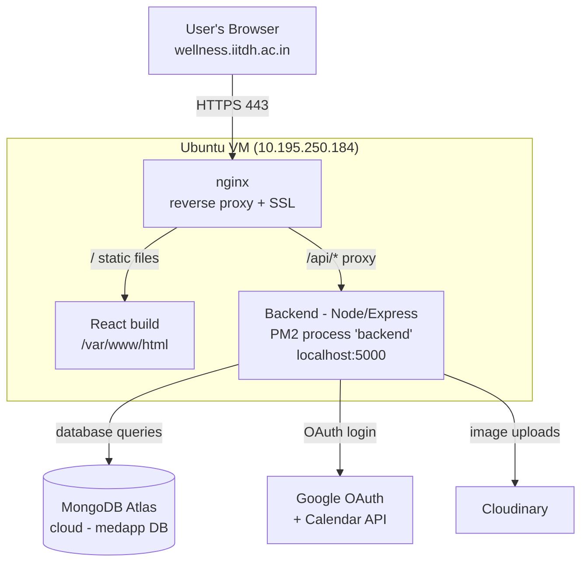

# Wellness App — Infrastructure & Deployment

How the app runs on the VM: what processes are running, how a request flows through the system, how we deploy updates, and how the server keeps itself healthy.

---

## 1. The big picture

The whole app runs on a **single Ubuntu VM** (`10.195.250.184`), reachable publicly at **https://wellness.iitdh.ac.in**. The database is the only piece that lives *outside* the VM (MongoDB Atlas, in the cloud).



**In one sentence:** nginx receives every request, serves the website files directly, and forwards API calls to the Node backend, which talks to MongoDB Atlas and Google.

---

## 2. What's actually running on the VM

| Component | What it is | Where it lives | How it runs |
|---|---|---|---|
| **nginx** | Web server + reverse proxy + HTTPS | system service | `systemctl` (auto-starts on boot) |
| **Frontend** | React app, pre-built static files | `/var/www/html/` | Served by nginx (not a running process) |
| **Backend** | Node.js / Express API | `~/wellness/backend/` | **PM2** process named `backend` on port `5000` |
| **PM2** | Process manager that keeps the backend alive | system service | `systemctl` (auto-starts on boot) |
| **MongoDB** | Database | **Cloud (MongoDB Atlas)** — not on the VM | Managed by Atlas |

Key idea: the **frontend is not a running program** — it's just static files (HTML/JS/CSS) that nginx hands out. Only the **backend** is a live process, and **PM2** is what keeps it running and restarts it if it crashes.

---

## 3. How a request flows

**Loading the website (e.g. the login page):**
1. Browser requests `https://wellness.iitdh.ac.in/`
2. nginx terminates HTTPS (SSL certs in `/etc/nginx/ssl/`) and serves the React files from `/var/www/html/`
3. The React app loads in the browser

**An API call (e.g. fetching appointments):**
1. React calls `https://wellness.iitdh.ac.in/api/my-appointments`
2. nginx sees the `/api/` path and **proxies** it to the backend at `localhost:5000`
3. The backend queries **MongoDB Atlas**, gets the data, returns JSON
4. React displays it

**Google login:**
1. User clicks "Login with Google" → backend redirects to Google OAuth
2. Google redirects back to `/api/auth/google/callback`
3. Backend verifies the user, issues a session/JWT, redirects into the app

> This is why a **backend being down shows "502 Bad Gateway"** — nginx is fine and tries to forward the `/api/` call, but there's no backend on port 5000 to answer.

---

## 4. Deployment (how to push updates)

All commands run on the VM over SSH (`ssh wc@10.195.250.184`). Standard sequence:

```bash
cd ~/wellness
git pull origin main          # get latest code from GitHub

# --- Backend ---
cd backend
npm install                   # install any new packages
pm2 restart backend --update-env   # restart with latest code + env

# --- Frontend ---
cd ../frontend
npm install
npm run build                 # produce fresh static files
sudo rsync -av --delete build/ /var/www/html/   # deploy them
sudo systemctl restart nginx

# --- Verify ---
pm2 list                      # backend should say 'online'
sudo nginx -t                 # config should be 'ok'
```

Then open https://wellness.iitdh.ac.in and confirm login + dashboard work.

**Important notes:**
- **`.env` files are NOT in git** (they hold secrets). They live only on the VM. If a secret changes, edit `~/wellness/backend/.env` by hand — `git pull` never touches it.
- **SSL certificates** live in `/etc/nginx/ssl/` (outside the project). Don't delete them; they only change when IITDH issues new ones.
- If `git pull` reports a conflict, stop — don't force it — the VM may have local edits.

---

## 5. Configuration & secrets

**Backend `~/wellness/backend/.env`** (key values):
```
PORT=5000
NODE_ENV=production
BACKEND_URL=https://wellness.iitdh.ac.in
FRONTEND_URL=https://wellness.iitdh.ac.in
GOOGLE_CALLBACK_URL=https://wellness.iitdh.ac.in/api/auth/google/callback
MONGO_URI=<MongoDB Atlas connection string>
JWT_SECRET=<secret>
SESSION_SECRET=<secret>
```

**MongoDB connection note:** we use the **non-SRV** Atlas connection string (lists the shard hosts directly) instead of the shorter `mongodb+srv://` form. The `+srv` version needs a DNS SRV lookup that was intermittently failing on the VM (`querySrv ESERVFAIL`) and taking the app down. The non-SRV string avoids that. Database name is `medapp`.

**External services the backend uses:**
- **MongoDB Atlas** — database
- **Google OAuth + Calendar API** — login and appointment calendar events
- **Cloudinary** — image/file uploads

---

## 6. Keeping the server healthy (auto-maintenance)

The VM has a **20 GB disk**. The site once went down repeatedly because the disk filled to 100% (a full disk crashes PM2 → backend dies → 502). We put automatic safeguards in place so it can't fill up again:

| Safeguard | What it does |
|---|---|
| **PM2 log rotation** (`pm2-logrotate`) | Caps backend log files (max 10 MB each, keeps 5) so app logs can't grow forever |
| **journald size cap** (200 MB) | Limits system logs |
| **Weekly cleanup cron** (`/usr/local/bin/disk-cleanup.sh`, Sundays 3 AM) | Clears package caches, old snap versions, vacuums logs; warns in `/var/log/disk-cleanup.log` if disk > 85% |
| **PM2 startup service** | Backend auto-restarts if the VM reboots (`pm2 startup` + `pm2 save`) |

**Manual health check anytime:**
```bash
df -h /                       # disk usage — should stay well under 90%
pm2 list                      # backend should be 'online'
pm2 logs backend --lines 30   # recent backend activity / errors
```

---

## 7. Troubleshooting quick reference

| Symptom | Likely cause | Check / fix |
|---|---|---|
| **502 Bad Gateway** | Backend not running | `pm2 list` → if missing/errored, `pm2 restart backend`; check `df -h /` for full disk |
| **Site loads but API fails** | Backend up but DB unreachable | `pm2 logs backend` → look for MongoDB errors; check Atlas Network Access allowlist |
| **"Internal Server Error" on login** | Backend crashed / DB down | Same as above — check `pm2 logs backend` |
| **PM2 commands hang** | Disk full | `df -h /` → clean up if at 100% |
| **Site totally unreachable** | nginx down | `sudo systemctl status nginx`, `sudo nginx -t`, `sudo systemctl restart nginx` |

**Connect to the server:** `ssh wc@10.195.250.184` (plain SSH — avoid VS Code Remote-SSH; it copies ~3 GB onto the server and can fill the disk).

---

*Server: Ubuntu 22.04 VM · Node 20 · PM2 7 · nginx · MongoDB Atlas (medapp) · Domain: wellness.iitdh.ac.in*
