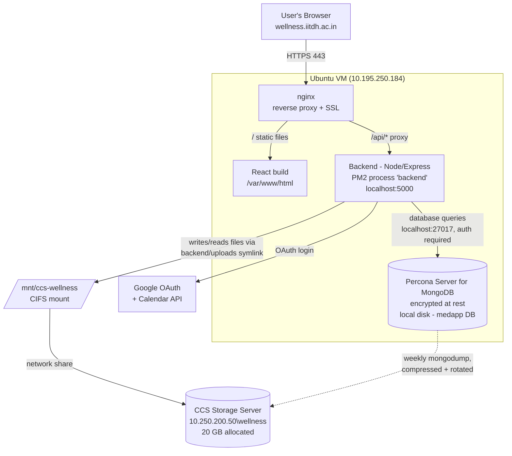

# Wellness App — Infrastructure & Deployment

How the app runs on the VM: what processes are running, how a request flows through the system, how we deploy updates, and how the server keeps itself healthy.

---

## 1. The big picture

The whole app runs on a **single Ubuntu VM** (`10.195.250.184`), reachable publicly at **https://wellness.iitdh.ac.in**. As of the September 2026 migration, **everything — app and database — runs on this one VM**; only uploaded files live on separate institute-provided network storage.


```mermaid
flowchart TD
    U[User's Browser<br/>wellness.iitdh.ac.in] -->|HTTPS 443| N[nginx<br/>reverse proxy + SSL]

    subgraph VM["Ubuntu VM (10.195.250.184)"]
        N -->|/ static files| F[React build<br/>/var/www/html]
        N -->|/api/* proxy| B[Backend - Node/Express<br/>PM2 process 'backend'<br/>localhost:5000]
        B -->|database queries<br/>localhost:27017, auth required| M[(Percona Server for MongoDB<br/>encrypted at rest<br/>local disk - medapp DB)]
    end

    B -->|OAuth login| G[Google OAuth<br/>+ Calendar API]
    B -->|writes/reads files via<br/>backend/uploads symlink| S[/mnt/ccs-wellness<br/>CIFS mount/]
    S -->|network share| CCS[(CCS Storage Server<br/>10.250.200.50\wellness<br/>20 GB allocated)]
    M -.->|weekly mongodump,<br/>compressed + rotated| CCS
```

**In one sentence:** nginx receives every request, serves the website files directly, and forwards API calls to the Node backend, which talks to a self-hosted, encrypted MongoDB running on the same VM, Google, and the institute's CCS network storage for uploaded files and database backups.

> **Why the database moved off Atlas:** MongoDB Atlas's free tier caps storage at 512 MB, and we wanted headroom independent of that cap. Self-hosting required deliberate care — see section 6 for why plain MongoDB Community Edition and the CCS network drive were both rejected along the way, and what replaced them.

> **Note:** Cloudinary integration code still exists in `backend/utils/cloudinary.js` but is **not used** — all image/document uploads (prescriptions, lab tests, vitals case sheets, note images) are compressed and saved to disk via `backend/utils/diskStorage.js` instead, which is cost-free and keeps large files out of the (storage-limited) MongoDB Atlas database.

---

## 2. What's actually running on the VM

| Component | What it is | Where it lives | How it runs |
|---|---|---|---|
| **nginx** | Web server + reverse proxy + HTTPS | system service | `systemctl` (auto-starts on boot) |
| **Frontend** | React app, pre-built static files | `/var/www/html/` | Served by nginx (not a running process) |
| **Backend** | Node.js / Express API | `~/wellness/backend/` | **PM2** process named `backend` on port `5000` |
| **PM2** | Process manager that keeps the backend alive | system service | `systemctl` (auto-starts on boot) |
| **MongoDB** | Database (Percona Server for MongoDB) | **On the VM**, `/var/lib/mongodb`, encrypted at rest | `systemctl` service `mongod`, auth required, `bindIp 127.0.0.1` only |
| **CCS network storage** | Uploaded files (prescriptions, lab documents, note images, etc.) | Institute storage server `10.250.200.50\wellness` (20 GB) | Mounted on the VM via CIFS at `/mnt/ccs-wellness`, symlinked to `~/wellness/backend/uploads` |

Key idea: the **frontend is not a running program** — it's just static files (HTML/JS/CSS) that nginx hands out. Only the **backend** is a live process, and **PM2** is what keeps it running and restarts it if it crashes.

---

## 3. How a request flows

**Loading the website (e.g. the login page):**
1. Browser requests `https://wellness.iitdh.ac.in/`
2. nginx terminates HTTPS (SSL certs in `/etc/nginx/ssl/`) and serves the React files from `/var/www/html/`
3. The React app loads in the browser

**An API call (e.g. fetching appointments):**
1. React calls `https://wellness.iitdh.ac.in/api/my-appointments`
2. nginx sees the `/api/` path and **proxies** it to the backend at `localhost:5000`
3. The backend queries **MongoDB running locally on the same VM** (`localhost:27017`, authenticated), gets the data, returns JSON
4. React displays it

**Google login:**
1. User clicks "Login with Google" → backend redirects to Google OAuth
2. Google redirects back to `/api/auth/google/callback`
3. Backend verifies the user, issues a session/JWT, redirects into the app

> This is why a **backend being down shows "502 Bad Gateway"** — nginx is fine and tries to forward the `/api/` call, but there's no backend on port 5000 to answer.

---

## 4. Deployment (how to push updates)

All commands run on the VM over SSH (`ssh wc@10.195.250.184`). Standard sequence:

```bash
cd ~/wellness
git pull origin main          # get latest code from GitHub

# --- Backend ---
cd backend
npm install                   # install any new packages
pm2 restart backend --update-env   # restart with latest code + env

# --- Frontend ---
cd ../frontend
npm install
npm run build                 # produce fresh static files
sudo rsync -av --delete build/ /var/www/html/   # deploy them
sudo systemctl restart nginx

# --- Verify ---
pm2 list                      # backend should say 'online'
sudo nginx -t                 # config should be 'ok'
```

Then open https://wellness.iitdh.ac.in and confirm login + dashboard work.

**Important notes:**
- **`.env` files are NOT in git** (they hold secrets). They live only on the VM. If a secret changes, edit `~/wellness/backend/.env` by hand — `git pull` never touches it.
- **SSL certificates** live in `/etc/nginx/ssl/` (outside the project). Don't delete them; they only change when IITDH issues new ones.
- If `git pull` reports a conflict, stop — don't force it — the VM may have local edits.

---

## 5. Configuration & secrets

**Backend `~/wellness/backend/.env`** (key values):
```
PORT=5000
NODE_ENV=production
BACKEND_URL=https://wellness.iitdh.ac.in
FRONTEND_URL=https://wellness.iitdh.ac.in
GOOGLE_CALLBACK_URL=https://wellness.iitdh.ac.in/api/auth/google/callback
MONGO_URI=mongodb://<db-username>:<db-password>@localhost:27017/medapp?authSource=admin
JWT_SECRET=<secret>
SESSION_SECRET=<secret>
```

**MongoDB connection note (historical):** before the September 2026 migration (see section 6), this pointed at a MongoDB Atlas cluster using a non-SRV connection string, to work around an intermittent DNS issue (`querySrv ESERVFAIL`) with the `+srv` form. Now that MongoDB runs locally, that DNS dependency no longer applies — `localhost` never needs DNS resolution.

**External services the backend uses:**
- **Google OAuth + Calendar API** — login and appointment calendar events
- **CCS network storage** — image/document uploads and database backups (Cloudinary code still exists but is unused — see section 1)
- ~~MongoDB Atlas~~ — retired; database is now self-hosted on the VM (section 6)

---

## 6. Self-hosted MongoDB (database)

As of September 2026, the database was migrated off MongoDB Atlas (cloud, free-tier capped at 512 MB) onto the VM itself, running **Percona Server for MongoDB** — a free, drop-in-compatible distribution of MongoDB that (unlike plain MongoDB Community Edition) includes encryption at rest. Two things were deliberately ruled out along the way, worth recording so they aren't tried again:

- **Plain MongoDB Community Edition** was rejected because it has no encryption-at-rest option at all (that's an Enterprise-only feature) — Percona Server for MongoDB was installed instead specifically to close that gap for free.
- **The CCS network drive (`/mnt/ccs-wellness`)** was tried as the database's data directory and **failed with a real crash** — MongoDB's storage engine (WiredTiger) cannot open its files over CIFS/SMB (`Operation not permitted` opening `WiredTiger.wt`, confirmed in `/var/log/mongodb/mongod.log`). Network filesystems don't support the file-locking behavior a live database needs. **The database's data directory must stay on the VM's own local disk** — only static files (uploads, backups) are safe on the CCS drive.

**Configuration (`/etc/mongod.conf`):**
```yaml
storage:
  dbPath: /var/lib/mongodb   # local disk — never point this at /mnt/ccs-wellness

security:
  enableEncryption: true
  encryptionKeyFile: /etc/mongodb-encryption-keyfile   # root-only, chmod 600
  authorization: enabled

net:
  port: 27017
  bindIp: 127.0.0.1   # only reachable from the VM itself
```

**Encryption at rest:** the key lives at `/etc/mongodb-encryption-keyfile` (generated with `openssl rand -base64 32`, `chmod 600`, owned by `mongod`). Verified by inserting a known string and confirming it does **not** appear in the raw `.wt` files under `/var/lib/mongodb` (`grep -a "<test string>" /var/lib/mongodb/*.wt` finds nothing).

**Authentication:** enabled via Percona's `percona-server-mongodb-enable-auth.sh` helper, which created an admin database user. Verified by confirming an unauthenticated `mongosh` command fails with "Command insert requires authentication," and the same command succeeds when passing `-u <user> -p --authenticationDatabase admin`.

**Migrating the data:** the one-time cutover from Atlas used `mongodump` (read-only against Atlas, safe) followed by `mongorestore --drop` into the local instance, then switching `MONGO_URI` in `.env` and restarting the backend. 488 documents migrated; verified by comparing per-collection `countDocuments()` between Atlas and the new instance before decommissioning Atlas access.

**Backups:** since leaving Atlas also means losing its automatic managed backups, a backup routine was built to replace it:
- `/usr/local/bin/mongo-backup.sh` runs `mongodump` (using credentials from `/etc/mongodb-backup.conf`, root-only, `chmod 600` — keeps the password out of `ps aux` and out of the script itself), compresses the result, **encrypts it** (AES-256, key at `/etc/mongodb-backup-encryption-key`, root-only), and saves the resulting `.tar.gz.enc` to **`/mnt/ccs-wellness/mongo-backups/`** (the CCS network drive — safe for this, since a backup is just an encrypted file, not a live database).
- Keeps only the **last 4 backups**, deleting older ones automatically.
- Logs each run to `/var/log/mongo-backup.log`.
- Scheduled via root's crontab: `0 4 * * 0 /usr/local/bin/mongo-backup.sh` (Sundays, 4 AM — an hour after the existing disk-cleanup cron in section 8, to avoid overlap).

**Manual backup/restore anytime:**
```bash
sudo /usr/local/bin/mongo-backup.sh                    # run a backup on demand
ls -la /mnt/ccs-wellness/mongo-backups/                 # see existing (encrypted) backups
cat /var/log/mongo-backup.log                           # backup run history

# To restore from one:
openssl enc -d -aes-256-cbc -pbkdf2 -in <backup>.tar.gz.enc -out backup.tar.gz -pass file:/etc/mongodb-backup-encryption-key
tar -xzf backup.tar.gz
```

**Still open (tracked separately, not yet done):** field-level encryption for specific sensitive fields (so even a holder of valid DB credentials can't read them), and a written data-retention/deletion policy.

---

## 7. Uploaded file storage (CCS network drive)

Uploaded files (prescriptions, lab test documents, vitals case sheets, note images, certificates) are compressed with `sharp` and written to disk by `backend/utils/diskStorage.js`, instead of being stored inside MongoDB or sent to Cloudinary. The actual storage lives on an institute-provided network share, not on the VM's own disk.

**How it's wired up:**
1. CCS (JTS) allocated **20 GB** of network storage at `\\10.250.200.50\wellness` (SMB/CIFS share), with credentials for a `wellness` service account.
2. On the VM, this share is mounted at **`/mnt/ccs-wellness`** using `cifs-utils`, with credentials stored in `/etc/ccs-wellness-credentials` (root-only, `chmod 600`) and an entry in `/etc/fstab` so it remounts automatically on reboot.
3. `~/wellness/backend/uploads` is a **symlink** pointing at `/mnt/ccs-wellness` — the app always writes to `backend/uploads/...`, and the symlink transparently redirects that onto the network share.
4. `server.js` serves files back out via `express.static(...)` mounted at `/uploads`, so a saved file becomes reachable at `https://wellness.iitdh.ac.in/uploads/wellness/<feature>/<filename>`. Only that short URL is stored in MongoDB — never the file itself.

**What happens when a file is uploaded (e.g. a lab test document):**
1. Browser sends the file to a route like `POST /api/tests/save`; `multer` receives it into memory (not saved anywhere yet).
2. If it's an image, `compressToTargetSize()` (in `utils/cloudinary.js`) shrinks/converts it to webp at the requested target size (10–300 KB depending on the field) — **this is the same compression function originally built for the Cloudinary path**; only the destination changed, not the compression itself.
3. `utils/diskStorage.js` writes the compressed bytes to `backend/uploads/wellness/<feature>/<timestamp>-<name>.webp` — which, via the symlink, actually lands on the CCS network share.
4. Only the resulting short URL (e.g. `/uploads/wellness/tests/1755-report.webp`) is saved into the MongoDB document — never the file bytes.
5. On later view, the frontend (`documentHelpers.js` → `buildDocumentUrl`) prefixes that path with the backend's base URL, and `express.static` serves the actual file back from the mount.

**Important operational notes:**
- If the `/mnt/ccs-wellness` mount ever drops (network blip, VM reboot before `_netdev` remount completes, credentials expired) and the symlink target becomes unreachable, **do not let the app silently fall back to writing a real local folder at `backend/uploads`** — that would start filling the VM's own small disk again and scatter files across two different storage locations. Check `mount | grep ccs-wellness` first if uploads start failing.
- Re-mount manually if needed: `sudo mount -a` (re-reads `/etc/fstab`).
- Check remaining space on the CCS share the same way as the local disk: `df -h /mnt/ccs-wellness`.

---

## 8. Keeping the server healthy (auto-maintenance)

The VM has a **20 GB disk**. The site once went down repeatedly because the disk filled to 100% (a full disk crashes PM2 → backend dies → 502). We put automatic safeguards in place so it can't fill up again:

| Safeguard | What it does |
|---|---|
| **PM2 log rotation** (`pm2-logrotate`) | Caps backend log files (max 10 MB each, keeps 5) so app logs can't grow forever |
| **journald size cap** (200 MB) | Limits system logs |
| **Weekly cleanup cron** (`/usr/local/bin/disk-cleanup.sh`, Sundays 3 AM) | Clears package caches, old snap versions, vacuums logs; warns in `/var/log/disk-cleanup.log` if disk > 85% |
| **Weekly MongoDB backup cron** (`/usr/local/bin/mongo-backup.sh`, Sundays 4 AM) | Dumps the database, compresses it, saves it to the CCS drive, keeps only the last 4 (see section 6) |
| **PM2 startup service** | Backend auto-restarts if the VM reboots (`pm2 startup` + `pm2 save`) |

**Manual health check anytime:**
```bash
df -h /                       # VM disk usage — should stay well under 90%
df -h /mnt/ccs-wellness        # CCS upload storage usage
mount | grep ccs-wellness      # confirm the network share is actually mounted
sudo systemctl status mongod   # database should be 'active (running)'
pm2 list                      # backend should be 'online'
pm2 logs backend --lines 30   # recent backend activity / errors
```

---

## 9. Troubleshooting quick reference

| Symptom | Likely cause | Check / fix |
|---|---|---|
| **502 Bad Gateway** | Backend not running | `pm2 list` → if missing/errored, `pm2 restart backend`; check `df -h /` for full disk |
| **Site loads but API fails** | Backend up but MongoDB unreachable/down | `pm2 logs backend` → look for MongoDB connection errors; `sudo systemctl status mongod` |
| **"Internal Server Error" on login** | Backend crashed / DB down | Same as above — check `pm2 logs backend` |
| **PM2 commands hang** | Disk full | `df -h /` → clean up if at 100% |
| **Site totally unreachable** | nginx down | `sudo systemctl status nginx`, `sudo nginx -t`, `sudo systemctl restart nginx` |
| **Backend logs "MongoServerError: Command requires authentication" or similar** | `MONGO_URI` credentials wrong/missing in `.env`, or `mongod`'s auth got disabled | Confirm `MONGO_URI` matches the real DB username/password; `cat /etc/mongod.conf` should show `authorization: enabled` |
| **mongod won't start / crashes immediately** | Encryption keyfile missing, wrong permissions, or corrupted data files | `sudo journalctl -u mongod --since "10 minutes ago"` and `sudo tail -50 /var/log/mongodb/mongod.log`; confirm `/etc/mongodb-encryption-keyfile` exists with `chmod 600` |
| **No recent file in `/mnt/ccs-wellness/mongo-backups/`** | Backup cron didn't run or failed | `cat /var/log/mongo-backup.log`; run `sudo /usr/local/bin/mongo-backup.sh` manually and watch for errors; confirm `sudo crontab -l` still has the entry |
| **File upload fails / 500 error on save** | CCS network share not mounted, or `backend/uploads` symlink missing/broken | `mount \| grep ccs-wellness` (remount with `sudo mount -a` if missing); `ls -la ~/wellness/backend/uploads` (should show `-> /mnt/ccs-wellness`, recreate with `ln -s /mnt/ccs-wellness ~/wellness/backend/uploads` if not) |
| **Uploaded file saves but 404s when viewed** | `backend/uploads` isn't a symlink to the CCS mount — files landed on local VM disk instead | Check `ls -la ~/wellness/backend/uploads`; if it's a real folder instead of a symlink, files inside need to be moved onto `/mnt/ccs-wellness` before re-creating the symlink |

**Connect to the server:** `ssh wc@10.195.250.184` (plain SSH — avoid VS Code Remote-SSH; it copies ~3 GB onto the server and can fill the disk).

---

*Server: Ubuntu 22.04 VM · Node 20 · PM2 7 · nginx · Percona Server for MongoDB 7.0 (medapp, local, encrypted + authenticated) · CCS network storage (uploads + backups) · Domain: wellness.iitdh.ac.in*
